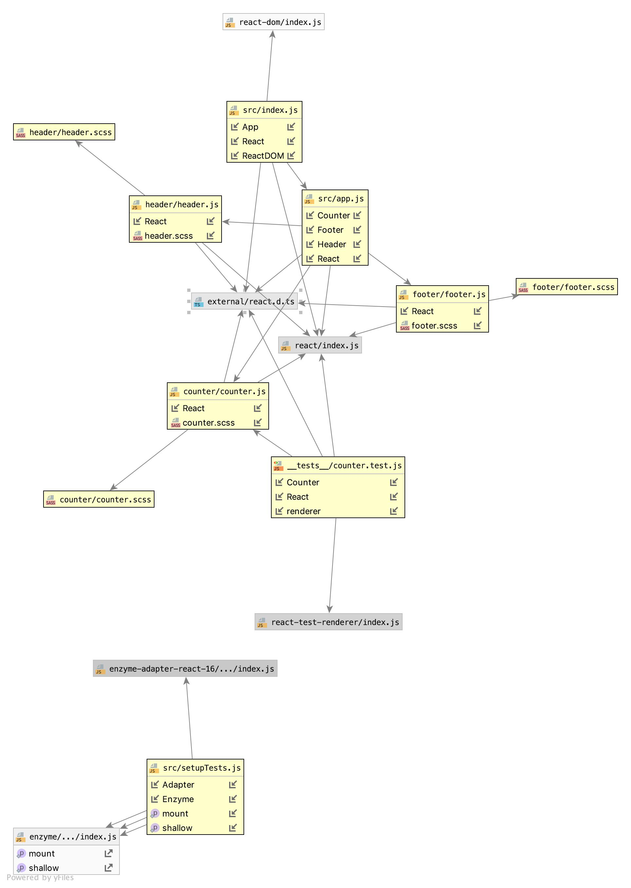

# LAB - 27

## React Deployment

### Author: Jessica Walters

### Links and Resources
* [submission PR](https://github.com/401-advanced-javascript-jessica/401-lab-27/pull/2)
* [travis](https://www.travis-ci.com/401-advanced-javascript-jessica/401-lab-27)
* [Netlify](https://5d816a00cfa6c10184dd8564--angry-ramanujan-4092e6.netlify.com/)
* [S3](http://jessica401lab27.s3-website-us-west-2.amazonaws.com/#)
* [Amplify](https://master.d1yg7cejsn4tw7.amplifyapp.com/#)

#### Documentation
* [styleguide](http://xyz.com)

### Components
#### `counter.js`
#### `footer.js`
#### `header.js`

### Setup

#### Running the app
* `npm run start`
  
#### Tests
* `npm run test`

#### UML
